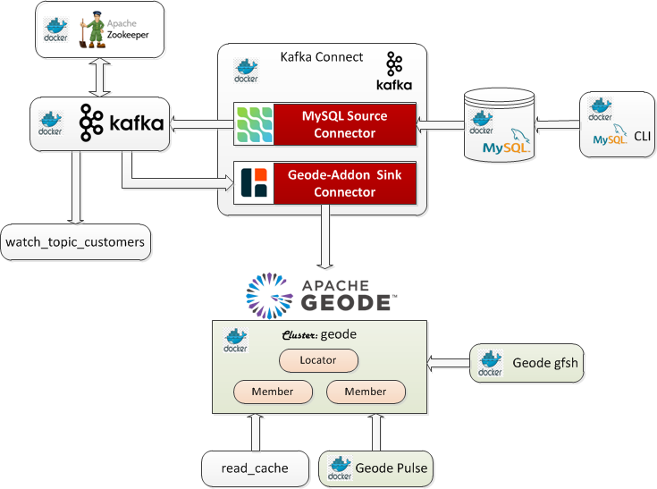
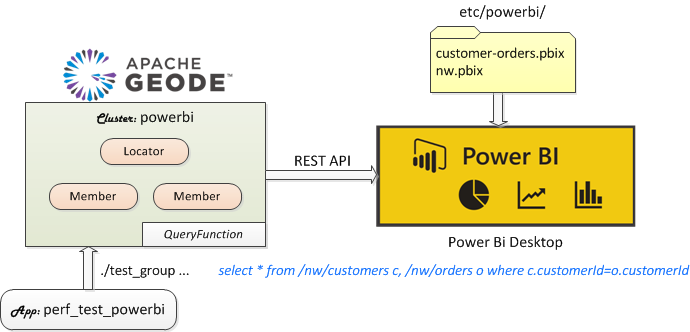
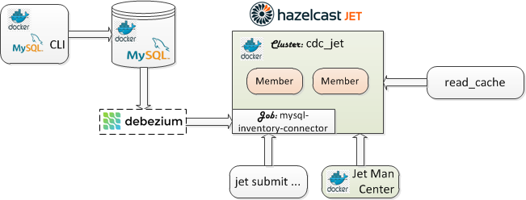
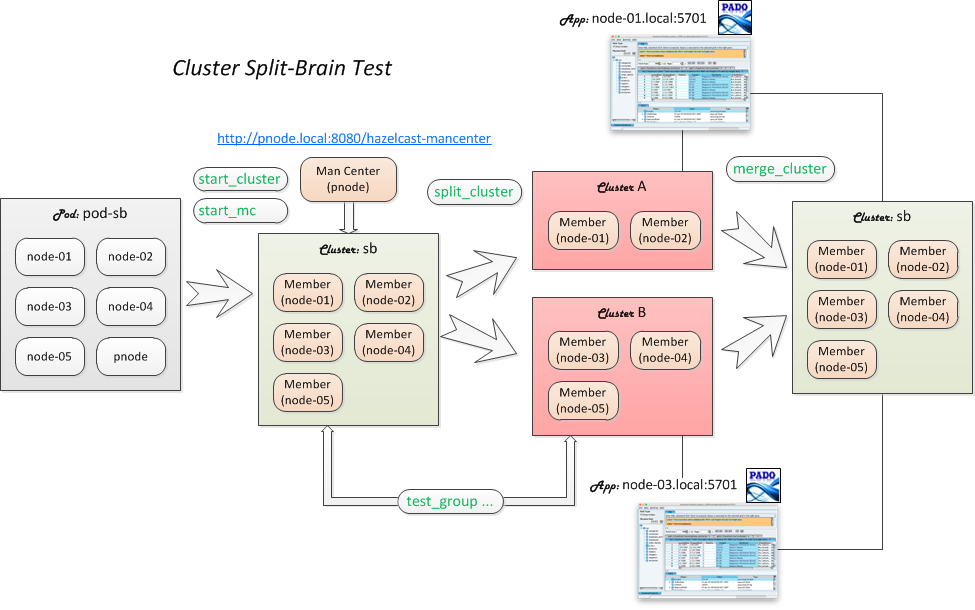
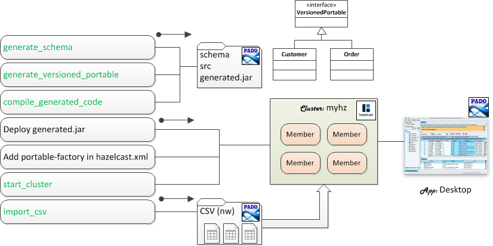
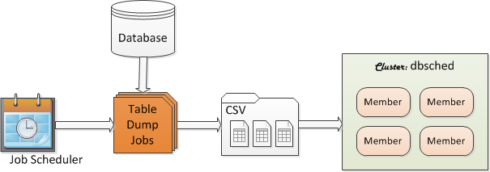
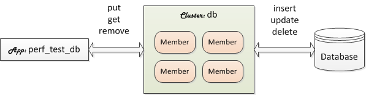
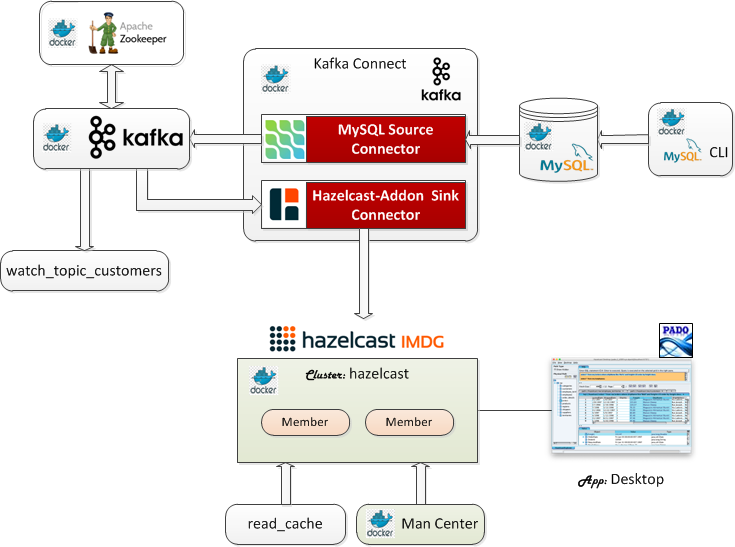
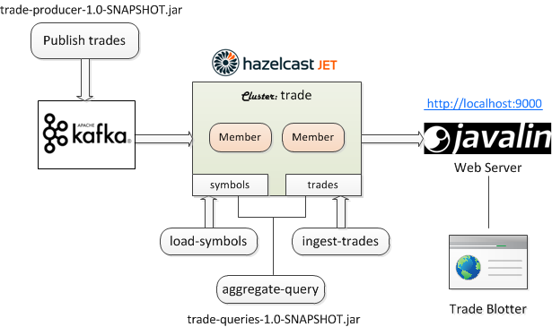
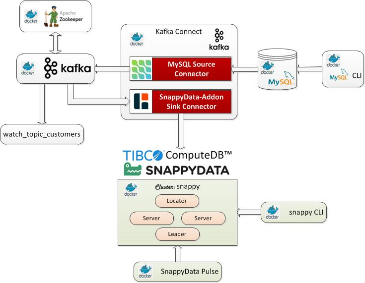

# :books: Combined Bundle Catalog - Use Cases :books:

This catalog combines all the online PadoGrid bundles. 

The online bundles can be installed by executing the `install_bundle` commands as shown below. To view use case details for each bundle, click on their image.


# Geode/GemFire Bundles

---

## DB Sync - Geode 1.x, GemFire 9.x

```console
install_bundle -download bundle-geode-1-app-perf_test_mysql-cluster-mysql
```

[](https://github.com/padogrid/bundle-geode-1-app-perf_test_mysql-cluster-mysql)

---

## Debezium-Kafka Geode/GemFire Connector - Geode 1.x, GemFire 9.x

```console
install_bundle -download bundle-geode-1-docker-debezium_kafka
```

[](https://github.com/padogrid/bundle-geode-1-docker-debezium_kafka)

---

## Power BI - Geode 1.x, GemFire 9.x

```console
install_bundle -download bundle-geode-1-app-perf_test_powerbi-cluster-powerbi
```

[](https://github.com/padogrid/bundle-geode-1-app-perf_test_powerbi-cluster-powerbi)

---

## WAN Bundle - Geode 1.x, GemFire 9.x

```console
install_bundle -download bundle-geode-1-app-perf_test_wan-cluster-ln-ny
```

[](https://github.com/padogrid/bundle-geode-1-app-perf_test_wan-cluster-ln-ny)

---


# Hazelcast/Jet Bundles

---

## CDC Tutorial - Jet 4

```console
install_bundle -download bundle-jet-4-docker-cdc_tutorial
```

[](https://github.com/padogrid/bundle-jet-4-docker-cdc_tutorial)

---

## Cluster Split-Brain - IMDG 3

```console
install_bundle -download bundle-hazelcast-3-app-perf_test_sb-cluster-sb
```

[](https://github.com/padogrid/bundle-hazelcast-3-app-perf_test_sb-cluster-sb)

---

## CVS File Importer (VersionedPortable) - IMDG 3

```console
install_bundle -download bundle-hazelcast-3-app-pado
```

[](https://github.com/padogrid/bundle-hazelcast-3-app-pado)

---

## DB Scheduler - IMDG 3

```console
install_bundle -download bundle-hazelcast-3-app-pado_dbsched-perf_test_dbsched-cluster-dbsched
```

[](https://github.com/padogrid/bundle-hazelcast-3-app-pado_dbsched-perf_test_dbsched-cluster-dbsched)

---

## DB Sync - IMDG 3

```console
install_bundle -download bundle-hazelcast-3-app-perf_test_db-cluster-db
```

[](https://github.com/padogrid/bundle-hazelcast-3-app-perf_test_db-cluster-db)

---

## Debezium-Kafka Hazelcast Connector - IMDG 3 and 4

```console
install_bundle -download bundle-hazelcast-3n4-docker-debezium_kafka
```

[](https://github.com/padogrid/bundle-hazelcast-3n4-docker-debezium_kafka)

---

## Real-Time Trade Monitor - Jet 3

```console
install_bundle -download bundle-jet-3-cluster-trade
```

[](https://github.com/padogrid/bundle-jet-3-cluster-trade)

## Debezium-Kafka SnappyData/ComputeDB Connector - SnappyData 1.x

```console
install_bundle -download bundle-snappydata-1-docker-debezium_kafka
```

## Training: OpenSSL/BoringSSL - IMDG 3

```console
install_bundle -download bundle-hazelcast-training-3-app-perf_test_openssl-cluster-openssl
```

[](https://github.com/padogrid/bundle-hazelcast-training-3-app-perf_test_openssl-cluster-openssl)

---

## Training: Rolling Upgrade - IMDG 3.11.x

```console
install_bundle -download bundle-hazelcast-training-3.11-app-perf_test_v3.11-cluster-v3.11
```

[](https://github.com/padogrid/bundle-hazelcast-training-3.11-app-perf_test_v3.11-cluster-v3.11)

---

# SnappyData/ComputeDB Bundles

---

```console
install_bundle -download bundle-snappydata-1-docker-debezium_kafka
```

[](https://github.com/padogrid/bundle-snappydata-1-docker-debezium_kafka)
