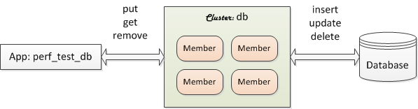

# :books: Geode/GemFire Bundle Catalog - Use Cases :books:

The online bundles can be installed by executing the `install_bundle` commands as shown below. To view use case details for each bundle, click on their image.

---

## DB Sync - Geode 1.x, GemFire 9.x

```console
install_bundle -download bundle-geode-1-app-perf_test_mysql-cluster-mysql
```

[](https://github.com/padogrid/bundle-geode-1-app-perf_test_mysql-cluster-mysql)

---

## Debezium-Kafka Geode/GemFire Connector - Geode 1.x, GemFire 9.x

```console
install_bundle -download bundle-geode-1-docker-debezium_kafka
```

[](https://github.com/padogrid/bundle-geode-1-docker-debezium_kafka)

---

## Debezium-Hive-Kafka Geode Connector - Geode 1.x, GemFire 9.x

```console
install_bundle -download bundle-geode-1-docker-debezium_hive_kafka
```

[](https://github.com/padogrid/bundle-geode-1-docker-debezium_hive_kafka)

---

## Debezium-KSQL-Kafka Geode/GemFire Connector - Geode 1.x, GemFire 9.x

```console
install_bundle -download bundle-geode-1-docker-debezium_ksql_kafka
```

[](https://github.com/padogrid/bundle-geode-1-docker-debezium_ksql_kafka)

---

## Power BI - Geode 1.x, GemFire 9.x

```console
install_bundle -download bundle-geode-1-app-perf_test_powerbi-cluster-powerbi
```

[](https://github.com/padogrid/bundle-geode-1-app-perf_test_powerbi-cluster-powerbi)

---

## WAN Bundle - Geode 1.x, GemFire 9.x

```console
install_bundle -download bundle-geode-1-app-perf_test_wan-cluster-ln-ny
```

[](https://github.com/padogrid/bundle-geode-1-app-perf_test_wan-cluster-ln-ny)
